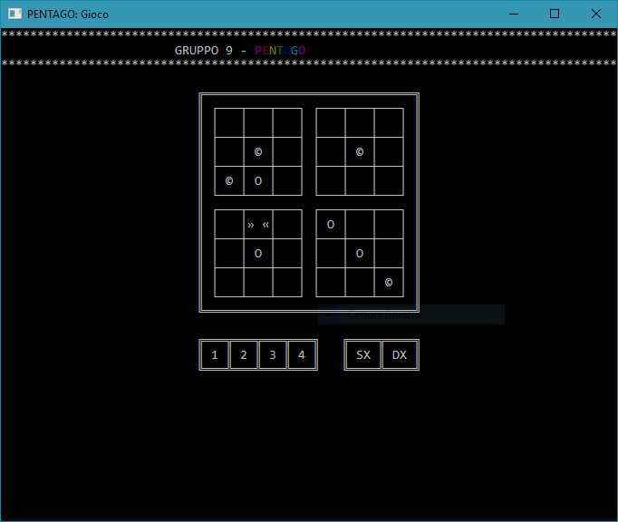
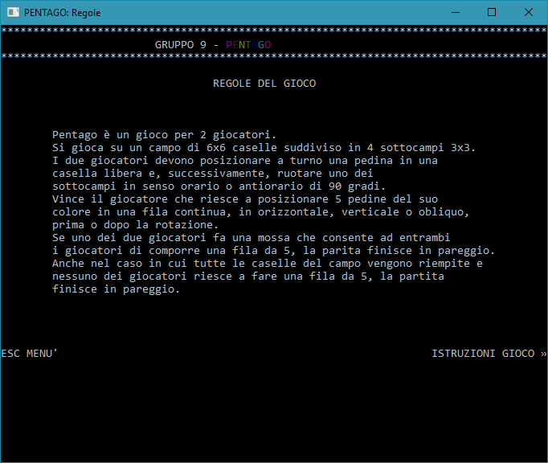
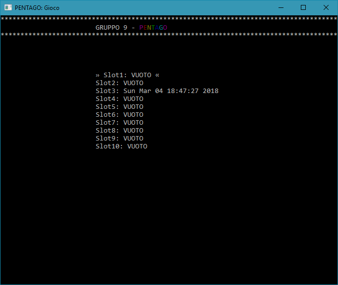
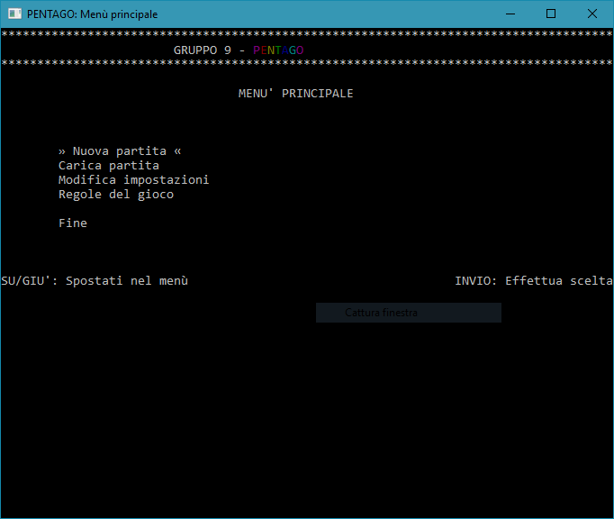
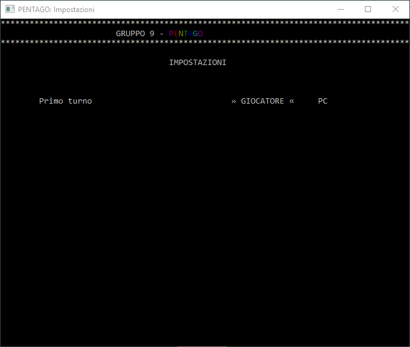

# PENTAGO Table Game

Pentago is a table game created by the swedish company Mindtwister.
I've created a version of this game in C language for my "Computer Science Laboratory" exam during second semester of first year at University of Bari.

## Disclaimer
This game was developed and tested only on Windows OS.
I did not test it on Linux and Mac OS and I'm only providing instructions to install and run it on Windows.
However, if you install and run this game succesfully on these two operating systems, see [CONTRIBUTING.md](CONTRIBUTING.md) to know how to contribute.

Also, the language used for instructions, game, code, comments and documentation is Italian.
If you want to translate some parts of the project or the entire project, see [CONTRIBUTING.md](CONTRIBUTING.md) to know how to contribute.

### Main Functionalities

These are the main functionalities provided by the game. This version uses also a GUI realized with symbols printed directly in the cmd window. This game also implements a very simple AI built with no particular theoric bases.

1. Play a new game
   - You can save the current game to resume it later without losing progress
2. Load a saved game
3. Change settings
   - You can change the starting player (eg. Computer instead of User)
4. Game rules and instructions to play

## Getting Started

To play the game, I'm providing an executable file to launch directly the game. You can also compile the source files and make your own executable file. See **Installing** section to get more informations.

### Installing

To install using pre-complied executable file, download the entire repository from GitHub and execute the [Pentago/pentago.exe](Pentago/pentago.exe) executable file.

To compile source files, you have to follow the following steps.

#### Install **MinGW**

1. Download MinGW compiler for your system
   - [MinGW (32bit and 64 bit)](https://sourceforge.net/projects/mingw-w64/files/latest/download)
2. Run the setup you have just downloaded and install MinGW
   - **For _32 bit_ Windows**, select i686 architecture during installation
   - **For _64 bit_ Windows**, select x86_64 architecture during installation
3. Once installation is completed, add to PATH variable the bin folder located in your MinGW installation folder
   - **For _32 bit_ Windows**, MinGW bin folder is usually located at _"C:\Program Files (x86)\mingw-w64\i686-7.2.0-posix-dwarf-rt_v5-rev1\mingw64\bin"_; add this to PATH variable; however, **this can change depending on version and settings selected during installation**
   - **For _64 bit_ Windows**, MinGW bin folder is usually located at _"C:\Program Files\mingw-w64\x86_64-7.2.0-posix-seh-rt_v5-rev1\mingw64\bin"_; add this to PATH variable; however, **this can change depending on version and settings selected during installation**
4. Check the correct installation by opening a cmd window and running 
   ```
   gcc --version
   ```
   
   If the installation went well, you will see something like this
   ```
   gcc (x86_64-posix-seh-rev1, Built by MinGW-W64 project) 7.2.0
   Copyright (C) 2017 Free Software Foundation, Inc.
   This is free software; see the source for copying conditions.  There is NO
   warranty; not even for MERCHANTABILITY or FITNESS FOR A PARTICULAR PURPOSE.
   ```

#### Download source files

Download the entire repository from GitHub and extract the [Pentago/src](Pentago/src) folder on desktop.

#### Compile source files

Open a cmd window as administrator in the **Pentago** folder you just extracted on desktop.
Then copy and paste the following commands and execute them:
```
gcc -O0 -g3 -Wall -c -fmessage-length=0 -o "src\\Debug\\partita.o" "src\\partita.c"
gcc -O0 -g3 -Wall -c -fmessage-length=0 -o "src\\Debug\\regolegioco.o" "src\\regolegioco.c"
gcc -O0 -g3 -Wall -c -fmessage-length=0 -o "src\\Debug\\9_pentago.o" "src\\9_pentago.c"
gcc -O0 -g3 -Wall -c -fmessage-length=0 -o "src\\Debug\\impostazioni.o" "src\\impostazioni.c"
gcc -O0 -g3 -Wall -c -fmessage-length=0 -o "src\\Debug\\giocatore.o" "src\\giocatore.c"
gcc -O0 -g3 -Wall -c -fmessage-length=0 -o "src\\Debug\\interfacciagrafica.o" "src\\interfacciagrafica.c"
gcc -O0 -g3 -Wall -c -fmessage-length=0 -o "src\\Debug\\menu.o" "src\\menu.c"
gcc -O0 -g3 -Wall -c -fmessage-length=0 -o "src\\Debug\\ia.o" "src\\ia.c"
gcc -O0 -g3 -Wall -c -fmessage-length=0 -o "src\\Debug\\file.o" "src\\file.c"
gcc -O0 -g3 -Wall -c -fmessage-length=0 -o "src\\Debug\\funzionistruttdati.o" "src\\funzionistruttdati.c"
gcc -o pentago.exe "src\\Debug\\9_pentago.o" "src\\Debug\\file.o" "src\\Debug\\funzionistruttdati.o" "src\\Debug\\giocatore.o" "src\\Debug\\ia.o" "src\\Debug\\impostazioni.o" "src\\Debug\\interfacciagrafica.o" "src\\Debug\\menu.o" "src\\Debug\\partita.o" "src\\Debug\\regolegioco.o"
```

Now, in the **Pentago folder**, you will have a **pentago.exe** executable file. Run it to play the game.
   
## Running the tests

To run tests, you have to install CUnit in your MinGW compiler. Search on Google how to install CUnit and how to add CUnit libraries to your project based on your own IDE. 
Once you added the CUnit test to your project, you can use the [Pentago/test](Pentago/test) project containing the [9_test.c](Pentago/test/src/9_test.c) main file to add you own tests.
Once you added your tests, simply build and run this _test_ project and execute the .exe file to test the application. 
Remember that if you need to test functions operating on files (like settings, game savings etc.) you have to copy the .txt test files in [Pentago/test/Test_.txt_files](Pentago/test/Test_.txt_files) to the folder where your test .exe is located.

### Break down into end to end tests

The default tests in [9_test.c](Pentago/test/src/9_test.c) main file of the project are used to test the main functions of the program.
However, you can test your functions by adding lines of code in the main file mentioned above.
For example, if you want to test a function named "your_own_function", you have to add these lines of code:

```
void test_your_own_function(void){
	//tests that are supposed to be successful
	CU_ASSERT_EQUAL(CORRECT_OUTPUT,your_own_function(INPUT_A));
	//tests that are supposed to be unsuccessfull
	CU_ASSERT_EQUAL(NOT_CORRECT_OUTPUT,your_own_function(INPUT_A));
}
```

## Built With

- [Eclipse](http://www.eclipse.org/downloads/packages/eclipse-ide-cc-developers/oxygen2) - IDE
- [MinGW](https://sourceforge.net/projects/mingw-w64/) - Compiler (gcc for Windows)
- [CUnit](https://sourceforge.net/projects/cunit/) - Test framework

## Contributing

To contribute to this project, see [CONTRIBUTING.md](CONTRIBUTING.md).

## Authors

- **Pierpasquale Colagrande** - _Initial work_ - [pierclgr](https://github.com/pierclgr)
- **Rocco Debellis** - _Initial work_ - [roccodebellis](https://github.com/roccodebellis)

See also the list of [contributors](https://github.com/pierclgr/PENTAGO-TABLE-GAME/contributors) who participated in this project.

## License

This program is licensed under GNU General Public License v3, see [LICENSE](LICENSE) for more details.

## Acknowledgments

- Slides given from my teacher
- Always friendly neighborhood Google
- Searchings for bug fixes

## Screenshots






